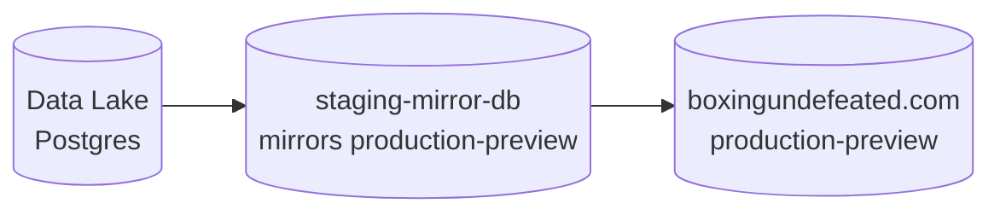
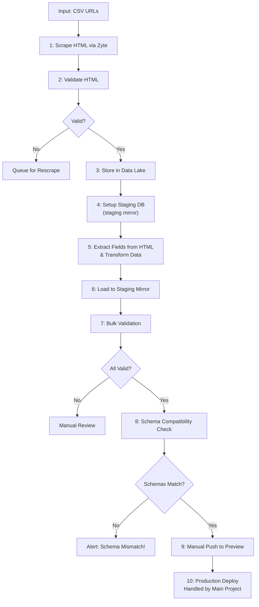

# DBs



# Pipeline Flow



## Running the Pipeline

### 0. Clear dbs (optional)

Clear the staging db

```bash
cd boxing/database && npx tsx clear-staging-data.ts
```

Clear the datalake
```bash
source .env && PGPASSWORD=$POSTGRES_PASSWORD psql -h $POSTGRES_HOST -p $POSTGRES_PORT -U $POSTGRES_USER -d $POSTGRES_DEFAULT_DB -c "DELETE FROM data_lake.boxrec_boxer_raw_html;"
```

### Step 1: Scrape HTML via Zyte

0. Optionally you can clear the pending/ folder to start fresh by just deleting all the files in:
```
boxing/data/output/html/pending
``` 

and 

```
boxing/data/output/html/validated
```
   
```bash
# Scrape boxer single pages
cd /data-pipelines
source .venv/bin/activate
python -m boxing.scrapers.boxrec.boxer [FILENAME.csv]
```

### Step 2: Validate HTML
```bash
python -m boxing.run_validators
```

### Step 3: Load to Data Lake (Postgres)
```bash
python -m boxing.load.to_data_lake
```

### Step 4: Setup staging-db (staging mirror)
```bash
cd boxing
python run_pipeline.py setup
```

### Steps 5-6: ETL (Extract, Transform, Load)

This command loads data from the data lake to the staging mirror database:
- Connects to the data lake (Postgres)
- Reads HTML records from `data_lake.boxrec_boxer_raw_html` table
- Extracts boxer and bout data from the HTML
- Transforms the extracted data
- Loads it into the staging mirror database

```bash
cd /data-pipelines
source .venv/bin/activate
python -m boxing.run_pipeline load
```

The output will show:
- Number of records loaded successfully
- Total boxers and bouts in staging after loading
- Any errors encountered during extraction/loading

### Step 7: 

Bulk validation (Step 7) runs data quality checks on the staging database to
ensure data integrity before deployment. It checks for:

1. Required fields - Ensures no NULL values in critical fields like boxer ID,
name, BoxRec URL
2. Data consistency - Validates that boxer records have proper format and
relationships
3. Referential integrity - Checks that bout records reference valid boxer IDs
4. Data ranges - Verifies numeric values (wins, losses, draws) are within
valid ranges
5. Duplicate detection - Identifies duplicate boxer IDs or bout records
6. Format validation - Ensures dates, URLs, and other fields follow expected
formats

If validation fails, it returns a report showing which checks failed and the
problematic records, preventing bad data from reaching production.

```bash
python -m boxing.run_pipeline validate
```


### Available commands:
- `setup` - Set up staging mirror database (run once before first use)
- `load` - Load from data lake to staging and extract data (steps 5-6) 
- `validate` - Run data validation checks (step 7)
- `deploy-preview` - Deploy to preview environment (step 9)
- `full` - Run complete pipeline


### drizzle studio on the staging db:

```bash
cd boxing/database/drizzle && npx drizzle-kit studio --config=drizzle.config.local.ts
```

Note: The pipeline assumes Postgres data lake is already set up with the `data_lake.boxrec_boxer_raw_html` table.

## TODOs

- **URL Normalization**: Handle mixed BoxRec URL patterns (`proboxer/` vs `box-pro/`). Should normalize to canonical format and store final redirected URL, not original input URL.
- **Field Normalization**: Data extracted from HTML needs normalization before loading to staging:
  - Date format: Convert `Apr 02` to `YYYY-MM-DD` format
  - Result values: Convert `win/loss` to `W/L` format expected by validation
  - Add transformation step between extraction and loading
