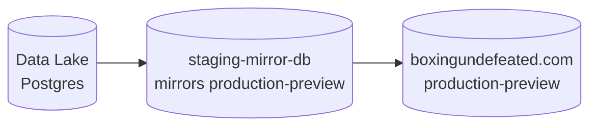
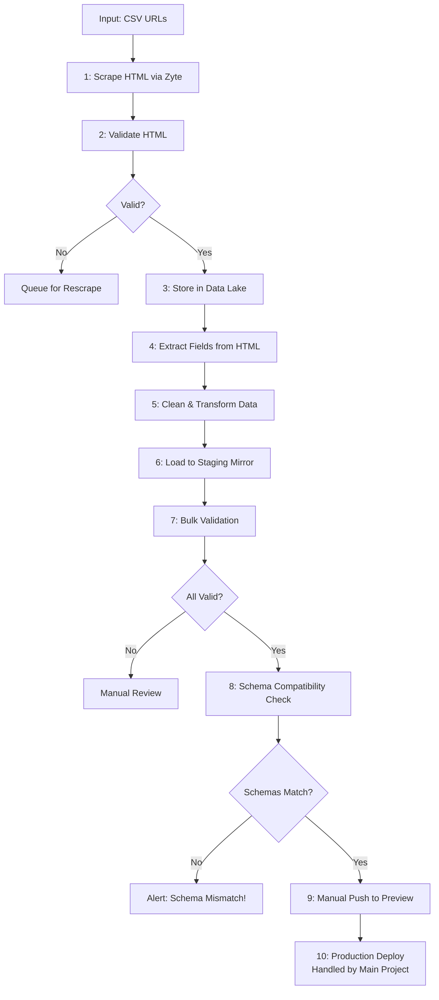

# DBs



# Pipeline Flow



## Running the Pipeline

### 0. Clear dbs (optional)

Clear the staging db

```bash
cd boxing/database && npx tsx clear-staging-data.ts
```

Clear the datalake
```bash
source .env && PGPASSWORD=$POSTGRES_PASSWORD psql -h $POSTGRES_HOST -p $POSTGRES_PORT -U $POSTGRES_USER -d $POSTGRES_DEFAULT_DB -c "DELETE FROM data_lake.boxrec_boxer_raw_html;"
```

### Step 1: Scrape HTML via Zyte
```bash
# Scrape boxer single pages
cd /Users/devin/repos/projects/boxingundefeated-monorepo/data-pipelines
source .venv/bin/activate
python -m boxing.scrapers.boxrec.boxer [FILENAME.csv]
```

### Step 2: Validate HTML
```bash
python -m boxing.run_validators
```

### Step 3: Load to Data Lake (Postgres)
```bash
python -m boxing.load.to_data_lake
```

### Steps 4-9: Process, Validate, and Deploy

Before loading data to staging, set up the staging database (only needed once):
```bash
python -m boxing.run_pipeline setup
```

Then run these commands:
```bash
cd /Users/devin/repos/projects/boxingundefeated-monorepo/data-pipelines
source .venv/bin/activate

# Load from data lake to staging and extract data (Steps 4-6)
python -m boxing.run_pipeline load

# Run data validation checks (Step 7)
python -m boxing.run_pipeline validate

# Deploy to preview (Step 9)
python -m boxing.run_pipeline deploy-preview
```

### Available commands:
- `setup` - Set up staging mirror database (run once before first use)
- `load` - Load from data lake to staging and extract data (steps 4-6) 
- `validate` - Run data validation checks (step 7)
- `deploy-preview` - Deploy to preview environment (step 9)
- `full` - Run complete pipeline
- `test` - Run all tests
- `test-watch` - Run tests in watch mode


### drizzle studio on the staging db:

```bash
cd /Users/devin/repos/projects/boxingundefeated-monorepo/data-pipelines/boxing/database/drizzle && npx drizzle-kit studio --config=drizzle.config.local.ts
```

**Automatic Testing**: Each pipeline command automatically runs relevant tests before executing. This ensures data quality at every step. To skip tests (not recommended), use `--skip-tests`.

Note: The pipeline assumes Postgres data lake is already set up with the `data-lake.boxrec_boxer_raw_html` table.

## TODOs

- **URL Normalization**: Handle mixed BoxRec URL patterns (`proboxer/` vs `box-pro/`). Should normalize to canonical format and store final redirected URL, not original input URL.
- **Field Normalization**: Data extracted from HTML needs normalization before loading to staging:
  - Date format: Convert `Apr 02` to `YYYY-MM-DD` format
  - Result values: Convert `win/loss` to `W/L` format expected by validation
  - Add transformation step between extraction and loading
