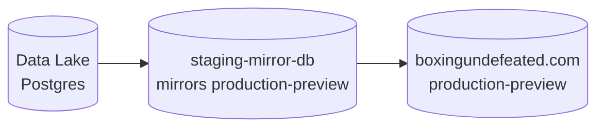
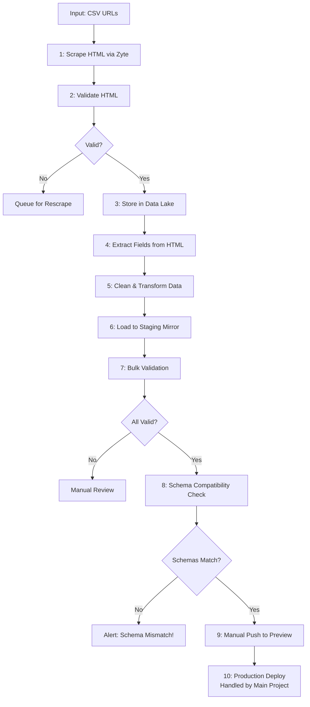

# DBs



# Pipeline Flow



## Running the Pipeline

### Step 1: Scrape HTML via Zyte
```bash
cd /Users/devin/repos/projects/boxingundefeated-monorepo/data-pipelines
source .venv/bin/activate
python -m boxing.scrapers.boxrec.boxer 1000boxers.csv
```

### Step 2: Validate HTML
```bash
python -m boxing.run_validators
```

### Steps 3-9: Process, Validate, and Deploy

Before loading data, set up the database (only needed once):
```bash
python -m boxing.run_pipeline setup
```

Then run these commands:
```bash
cd /Users/devin/repos/projects/boxingundefeated-monorepo/data-pipelines
source .venv/bin/activate

# Load scraped HTML and extract data (Steps 2-6)
python -m boxing.run_pipeline load

# Run validation checks (Step 7)
python -m boxing.run_pipeline validate

# Deploy to preview (Step 9)
python -m boxing.run_pipeline deploy-preview
```

Available commands:
- `setup` - Set up staging mirror database (run once before first use)
- `load` - Load scraped HTML and extract data to staging (steps 2-6)
- `validate` - Run data validation checks (step 7)
- `deploy-preview` - Deploy to preview environment (step 9)
- `full` - Run complete pipeline

## TODOs

- **URL Normalization**: Handle mixed BoxRec URL patterns (`proboxer/` vs `box-pro/`). Should normalize to canonical format and store final redirected URL, not original input URL.
- **Field Normalization**: Data extracted from HTML needs normalization before loading to staging:
  - Date format: Convert `Apr 02` to `YYYY-MM-DD` format
  - Result values: Convert `win/loss` to `W/L` format expected by validation
  - Add transformation step between extraction and loading
