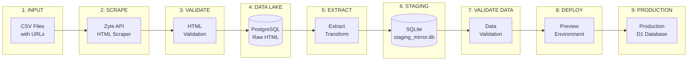

# Boxing Data Pipeline - Horizontal Flow with Function Mappings

## Pipeline Architecture Overview



## Detailed Pipeline Steps with Function Calls

### **Step 1: INPUT → SCRAPE**
**Purpose:** Read CSV files with BoxRec URLs and scrape HTML content

| File | Function | Description |
|------|----------|-------------|
| `scrapers/boxrec/boxer.py` | `main()` | Entry point for scraping |
| | `scrape_boxrec_urls()` | Reads CSV, manages scraping queue |
| | `scrape_single_url()` | Calls Zyte API for HTML |
| `utils/config.py` | `ZYTE_API_KEY` | API configuration |

**Command:** `python -m boxing.scrapers.boxrec.boxer [CSV_FILE]`

---

### **Step 2: SCRAPE → VALIDATE**
**Purpose:** Validate scraped HTML files for quality and completeness

| File | Function | Description |
|------|----------|-------------|
| `run_validators.py` | `main()` | Entry point for validation |
| | `validate_all_pending()` | Processes all pending HTML files |
| | `validate_html_file()` | Validates single HTML file |
| `validators/blank_page.py` | `validate()` | Checks for blank pages |
| `validators/error_page.py` | `validate()` | Detects error pages |
| `validators/rate_limit.py` | `validate()` | Identifies rate limit pages |
| `validators/login_page.py` | `validate()` | Detects login redirects |
| `validators/file_size.py` | `validate()` | Checks minimum file size |
| `validators/page/boxer.py` | `validate()` | Boxer-specific validation |

**Command:** `python -m boxing.run_validators`

---

### **Step 3: VALIDATE → DATA LAKE**
**Purpose:** Load validated HTML to PostgreSQL data lake

| File | Function | Description |
|------|----------|-------------|
| `load/to_data_lake.py` | `load_all_validated_files()` | Main loading function |
| | `load_html_to_data_lake()` | Loads single HTML file |
| | `extract_boxer_id_from_filename()` | Parses boxer ID |
| | `construct_boxrec_url()` | Builds BoxRec URL |
| | `get_competition_level()` | Determines am/pro level |
| `utils/config.py` | `get_postgres_connection()` | Database connection |

**Command:** `python -m boxing.load.to_data_lake`

---

### **Step 4: DATA LAKE → EXTRACT/TRANSFORM → STAGING**
**Purpose:** Extract data from HTML and load to staging database

| File | Function | Description |
|------|----------|-------------|
| `run_pipeline.py` | `load_data()` | Orchestrates ETL process |
| `load/to_staging_mirror_db.py` | `run_staging_load()` | Main ETL coordinator |
| | `StagingLoader.__init__()` | Initializes loader |
| | `StagingLoader.load_from_data_lake()` | Fetches from PostgreSQL |
| | `StagingLoader.process_boxer_html()` | Processes single boxer |
| `extract/orchestrator.py` | `ExtractionOrchestrator.extract_all()` | Extracts all fields |
| | `ExtractionOrchestrator.extract_boxer_fields()` | Boxer data extraction |
| | `ExtractionOrchestrator.extract_bouts()` | Bout data extraction |
| `extract/page/boxer/fields/*.py` | Various `extract()` functions | Field-specific extractors |
| `transform/boxer_id.py` | `normalize_boxer_id()` | Normalizes IDs |
| `transform/bout_data.py` | `normalize_bout_date()` | Date formatting |
| | `normalize_bout_result()` | Result standardization |
| `database/staging_mirror.py` | `StagingMirrorDB.insert_boxer()` | Inserts boxer record |
| | `StagingMirrorDB.insert_bout()` | Inserts bout record |

**Command:** `python -m boxing.run_pipeline load`

---

### **Step 5: STAGING → DATA VALIDATION**
**Purpose:** Validate data quality in staging database

| File | Function | Description |
|------|----------|-------------|
| `run_pipeline.py` | `validate_data()` | Runs validation suite |
| `database/validators/queries.py` | `run_validation()` | Main validation runner |
| | `DataValidator.__init__()` | Initializes validator |
| | `DataValidator.check_required_fields()` | NULL value checks |
| | `DataValidator.check_data_consistency()` | Data integrity checks |
| | `DataValidator.check_referential_integrity()` | Foreign key validation |
| | `DataValidator.check_duplicate_records()` | Duplicate detection |
| | `DataValidator.check_data_ranges()` | Range validation |
| | `DataValidator.check_url_formats()` | URL format validation |

**Command:** `python -m boxing.run_pipeline validate`

---

### **Step 6: STAGING → PREVIEW DEPLOYMENT**
**Purpose:** Deploy validated data to preview environment

| File | Function | Description |
|------|----------|-------------|
| `run_pipeline.py` | `deploy_preview()` | Deploys to preview |
| `database/deploy/preview.py` | `deploy_to_preview()` | Main deployment function |
| | `export_staging_to_sql()` | Exports SQL statements |
| | `push_to_d1_preview()` | Pushes to Cloudflare D1 |
| `database/validators/schema_validator.py` | `SchemaValidator.validate()` | Schema compatibility check |
| | `SchemaValidator.compare_schemas()` | Compares staging vs production |

**Command:** `python -m boxing.run_pipeline deploy-preview`

---

### **Step 7: PREVIEW → PRODUCTION**
**Purpose:** Final deployment to production (handled by main project)

| File | Function | Description |
|------|----------|-------------|
| External project | N/A | Handled by main boxing website project |

---

## Database Locations

| Database | Path/Location | Purpose |
|----------|---------------|---------|
| **Data Lake** | PostgreSQL @ `38.99.106.18:5978` | Raw HTML storage |
| **Staging Mirror** | `boxing/data/output/staging_mirror.db` | Local staging SQLite |
| **Preview** | Cloudflare D1 (preview) | Preview environment |
| **Production** | Cloudflare D1 (production) | Live website database |

## Configuration Files

| File | Purpose |
|------|---------|
| `utils/config.py` | Python pipeline configuration |
| `database/drizzle/drizzle.config.local.ts` | Drizzle ORM for staging DB |
| `database/drizzle/drizzle.config.d1.ts` | Drizzle ORM for D1 deployment |
| `wrangler.toml` | Cloudflare Workers configuration |

## Full Pipeline Command

To run the complete pipeline from start to finish:

```bash
cd /data-pipelines
source .venv/bin/activate
python -m boxing.run_pipeline full
```

This executes:
1 - `setup_database()` - Initialize staging DB
2 - `load_data()` - ETL from data lake to staging
3 - `validate_data()` - Run data validation
4 - `deploy_preview()` - Deploy to preview environment

## Common Issues & Solutions

| Issue | Solution |
|-------|----------|
| Missing `run_validation` import | Import exists in `database/validators/__init__.py` |
| Two staging DBs created | Fixed by removing unused `config.ts` |
| Schema mismatch errors | Run `python -m boxing.run_pipeline schema-validate` |
| Data validation failures | Check report output for specific field issues |

## Monitoring Functions

| Purpose | Command | Function |
|---------|---------|----------|
| Check for HTML changes | `python -m boxing.run_pipeline check-changes` | `run_change_detection()` |
| View staging data | `cd database && npm run db:studio` | Drizzle Studio UI |
| Validate schema compatibility | `python -m boxing.run_pipeline schema-validate` | `SchemaValidator.validate()` |