# BoxRec Data Pipeline Architecture

## High-Level Flow

```mermaid
graph LR
    %% Data Sources
    BoxRec[("BoxRec.com<br/>Website")]
    
    %% Scraping Layer
    Scraper["🕷️ Web Scraper<br/>(Python + BeautifulSoup)"]
    
    %% Raw Data Storage
    HTMLFiles[("📁 Raw HTML Files<br/>data/raw/boxrec_html/")]
    
    %% Parsing Layer
    Parser["🔄 HTML Parser v2<br/>(parse_boxer_v2.py)"]
    
    %% Structured Data
    JSONFiles[("📋 Individual JSON Files<br/>data/raw/boxrec_json_v2/")]
    
    %% Processing Layer
    Processor["⚙️ Data Processor<br/>(process_all.py)"]
    Migration["🔀 Migration Scripts<br/>(v1_to_v2.py)"]
    
    %% Combined Data
    ProcessedJSON[("📊 Processed JSON<br/>data/processed/v2/")]
    
    %% Aggregation
    Combiner["🔗 Data Combiner<br/>(combine_boxer_json_v2.py)"]
    
    %% Final Output
    CombinedData[("📦 Combined Dataset<br/>outputs/v2/combined_boxers.json")]
    
    %% Future: Database Layer
    StagingDB[("🗄️ Staging DB<br/>(Future: Drizzle ORM)")]
    
    %% Application Layer
    NuxtApp["🌐 Nuxt Application<br/>(Boxing Website)"]
    
    %% Flow
    BoxRec -->|"HTTP Requests"| Scraper
    Scraper -->|"Save HTML"| HTMLFiles
    HTMLFiles -->|"Read & Parse"| Parser
    Parser -->|"Extract Data"| JSONFiles
    JSONFiles -->|"Process"| Processor
    Processor -->|"Individual Files"| ProcessedJSON
    ProcessedJSON -->|"Aggregate"| Combiner
    Combiner -->|"Combined Data"| CombinedData
    
    %% Migration Path
    JSONFiles -.->|"Schema Updates"| Migration
    Migration -.->|"v1 → v2"| ProcessedJSON
    
    %% Future Database Flow
    CombinedData -.->|"Future: Import"| StagingDB
    StagingDB -.->|"Future: API"| NuxtApp
    
    %% Direct JSON Flow (Current)
    CombinedData -->|"Current: Direct JSON"| NuxtApp
    
    %% Styling
    classDef storage fill:#e1f5fe,stroke:#01579b,stroke-width:2px
    classDef process fill:#fff3e0,stroke:#e65100,stroke-width:2px
    classDef future fill:#f3e5f5,stroke:#4a148c,stroke-width:2px,stroke-dasharray: 5 5
    
    class HTMLFiles,JSONFiles,ProcessedJSON,CombinedData storage
    class Scraper,Parser,Processor,Migration,Combiner process
    class StagingDB,NuxtApp future
```



## Detailed Component Breakdown

### 1. **Data Source Layer**
- **BoxRec.com**: The source website containing boxer profiles and fight records
- **URLs**: Stored in `data/raw/boxrec_html/urls.csv`

### 2. **Scraping Layer**
- **Technology**: Python with requests library
- **Rate Limiting**: Respects robots.txt and implements delays
- **Output**: Raw HTML files preserved for reprocessing

### 3. **Storage Layer (Raw Data)**
```
data/raw/
├── boxrec_html/          # Raw HTML files
│   ├── en_box-pro_*.html # Boxer profile pages
│   └── en_event_*.html   # Event pages
└── boxrec_json/          # Initial parsed JSON
```

### 4. **Parsing Layer**
- **Parser v2**: Enhanced BeautifulSoup parser extracting:
  - Boxer profiles (40+ fields)
  - Fight records with opponent linking
  - Image URLs and page links
- **Schema**: JSON Schema v2.0.0 for validation

### 5. **Processing Layer**
```
scripts/
├── parse_boxer_v2.py      # HTML → JSON parser
├── process_all_v2.py      # Batch processing
└── combine_boxer_json.py  # Data aggregation
```

### 6. **Migration Layer**
- **Purpose**: Handle schema evolution
- **Current**: v1.0.0 → v2.0.0 migration
- **Future**: Automated migrations with Drizzle ORM

### 7. **Output Formats**

#### Individual Boxer JSON (v2.0.0)
```json
{
  "boxrec_id": "628407",
  "full_name": "Naoya Inoue",
  "image_url": "https://boxrec.com/images/...",
  "bouts": [
    {
      "opponent_id": "828415",
      "event_page_link": "https://boxrec.com/en/event/926864",
      "result_method": "ko",
      "result_round": 3
    }
  ]
}
```

#### Combined Dataset
```json
{
  "_metadata": {
    "schema_version": "2.0.0",
    "total_boxers": 99,
    "created_at": "2025-07-31T..."
  },
  "boxers": [...]
}
```

### 8. **Future: Database Layer**
- **ORM**: Drizzle (TypeScript-first)
- **Database**: PostgreSQL/SQLite
- **Benefits**:
  - Efficient querying
  - Relationship management
  - API endpoints
  - Real-time updates

### 9. **Application Layer**
- **Current**: Nuxt app reads JSON directly
- **Future**: API-based data access
- **Features**:
  - Boxer profiles
  - Fight history
  - Cross-linking between opponents
  - Search and filtering

## Data Flow Examples

### 1. **New Boxer Scrape**
```
BoxRec URL → Scraper → HTML File → Parser → JSON → Processor → Combined Dataset
```

### 2. **Schema Update**
```
Old JSON → Migration Script → New JSON → Validation → Combined Dataset
```

### 3. **Future: Real-time Update**
```
BoxRec API → Staging DB → Transform → Production DB → API → Nuxt App
```

## Key Design Decisions

1. **Preserve Raw Data**: HTML files kept for reprocessing
2. **Schema Versioning**: Explicit versions with migration paths
3. **Modular Pipeline**: Each stage can be run independently
4. **Opponent Linking**: BoxRec IDs enable fight network analysis
5. **Incremental Updates**: Support for adding new boxers without full rescrape

## Performance Characteristics

- **Current Dataset**: 99 boxers, ~30 bouts each
- **Processing Time**: ~1 minute for full pipeline
- **Storage**: ~50MB HTML, ~10MB processed JSON
- **Scalability**: Ready for 10,000+ boxer profiles

## Next Steps

1. **Implement Drizzle ORM** for database management
2. **Add bout detail scraping** (referee, judges, weights)
3. **Create API endpoints** for efficient data access
4. **Implement incremental updates** for live data
5. **Add data quality monitoring** and validation