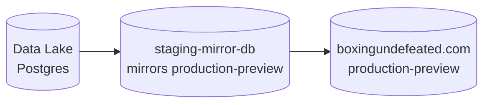
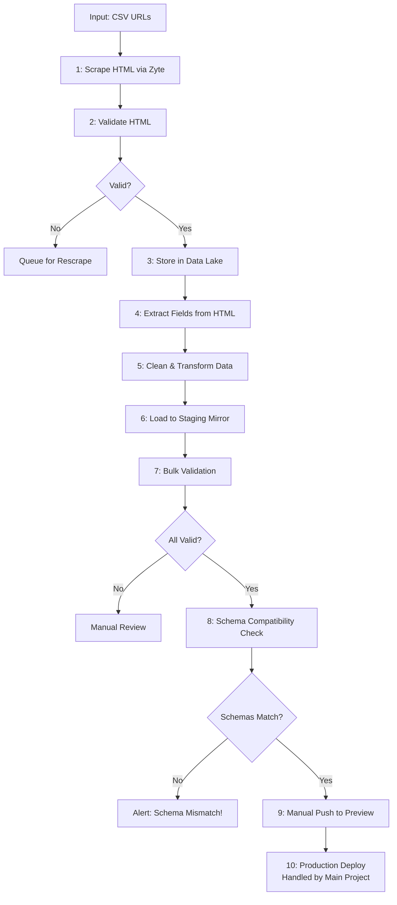

# DBs

```mermaid
graph LR
    DataLake[(Data Lake<br/>Postgres)] 
    Staging[(staging-mirror-db <br/>mirrors production-preview)]
    Preview[(boxingundefeated.com <br/> production-preview)]
    
    DataLake --> Staging
    Staging --> Preview
```

# Pipeline Flow

```mermaid
flowchart TD
    A[Input: CSV URLs] --> B["1: Scrape HTML via Zyte"]
    B --> C["2: Validate HTML"]
    C --> D{Valid?}
    D -->|No| E[Queue for Rescrape]
    D -->|Yes| F["3: Store in Data Lake"]
    F --> G["4: Extract Fields from HTML"]
    G --> H["5: Clean & Transform Data"]
    H --> I["6: Load to Staging Mirror"]
    I --> J["7: Bulk Validation"]
    J --> K{All Valid?}
    K -->|No| L[Manual Review]
    K -->|Yes| M["8: Schema Compatibility Check"]
    M --> N{Schemas Match?}
    N -->|No| O["Alert: Schema Mismatch!"]
    N -->|Yes| P["9: Manual Push to Preview"]
    P --> Q["10: Production Deploy<br/>Handled by Main Project"]
```
